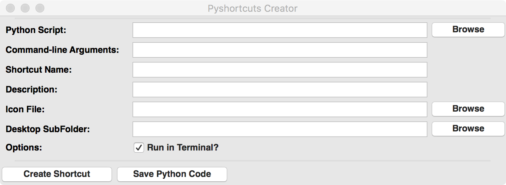

# pyshortcuts

Pyshortcuts helps developers and Python users to create desktop shortcuts
that will run python scripts and applications.

Pyshortcuts is cross-platform, supporting Windows, MacOS, and Linux each in
the way most natural for the OS.  On Windows, a Shortcut or Link is
created.  On Linux a ".desktop" file is created.  On MacOS, a minimal
Application is created.  In all cases, these shortcuts are put either
directly on the Desktop or in a folder on the Desktop of the current user.
That means that there is not need for elevated permission or writing to
system-level files (registry, /Applications, /usr/bin).  The user has
complete control to rename, move, or delete the shortcut after it is
created.

The shortcuts can have custom icons (`.ico` files on Windows or Linux, or
`.icns` files on MacOS), defaulting to a Python icon.

Pyshortcuts has a small footprint and is very easy to use either from a
python script (say as part of a installation or post-installation process)
as with

```
from pyshortcuts import make_shortcut

make_shortcut('/home/user/bin/myapp.py', 'MyApp', icon='/home/user/icons/myicon.ico')
```

or by using  the `pyshortcut` for a command-line application as with:

```
~> pyshortcut -n MyApp -i /home/user/icons/myicon.icns  /home/user/bin/myapp.py
```

To include command-line options to the script, put them in double quotes

```
~> pyshortcut -n MyApp -i /home/user/icons/myicon.icns "/home/user/bin/myapp.py  -t 10"
```

The `pyshortcut` command line program has the following optional arguments:

  * `--version`           show program's version number and exit
  * `-h`, `--help`        show help message and exit
  * `-n link_name`, `--name=link_name`  name for shortcut link
  * `-i icon_name`, `--icon=icon_name`  name of icon file
  * `-f subfolder`, `--folder=subfolder` subfolder on desktop to put icon
  * `-t`, `--terminal`   run script in a Terminal Window [True]
  * `-g`, `--gui`          run script as a GUI, with no Terminal Window [False]
  * `-w`, `--wxgui`     run GUI version of pyshortcut

Note that running in the Terminal is True by default, but that for GUI
applications the extra Terminal or Command Window may be unwanted.


In addition to the command line `pyshortcut` program there is a Pyshorcut
GUI providing a simple form to help the user browse for script, icons, and
set options before creating a shortcut or generating a Python script to
create the shortcut.



This can be launched with

```
~> pyshortcut --wxgui
```

Of course you might want to create a desktop shortcut for this, as
with this script (`gui_bootstrap.py` in the distribution):

```python
#!/usr/bin/env python
import os
import sys
from pyshortcuts import make_shortcut

make_shortcut("%s --wxgui" % os.path.join(sys.exec_prefix, 'bin', 'pyshortcut'),
              name='PyShortcut', terminal=False)
```
